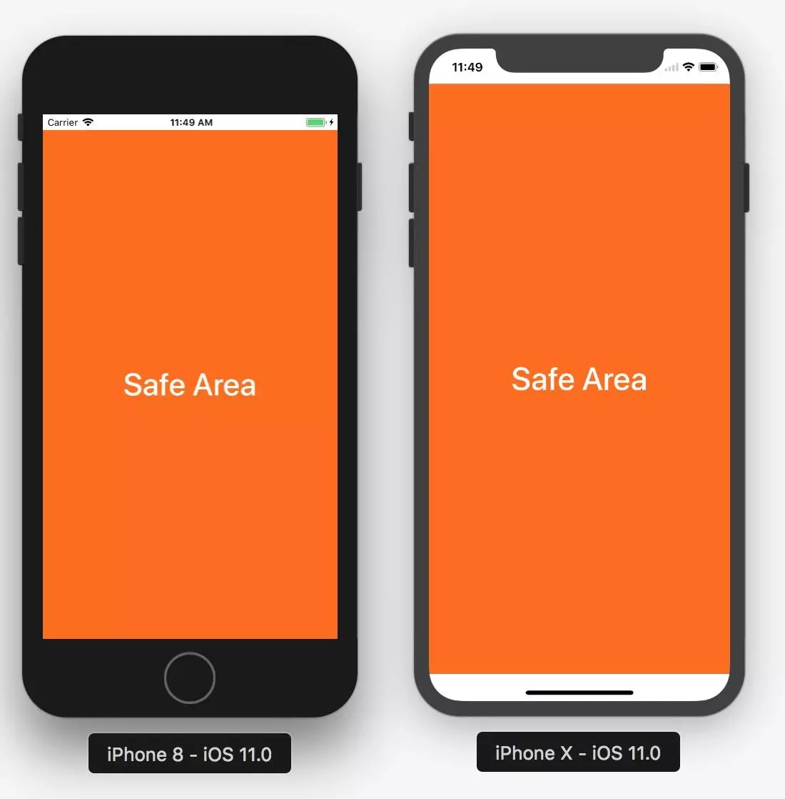
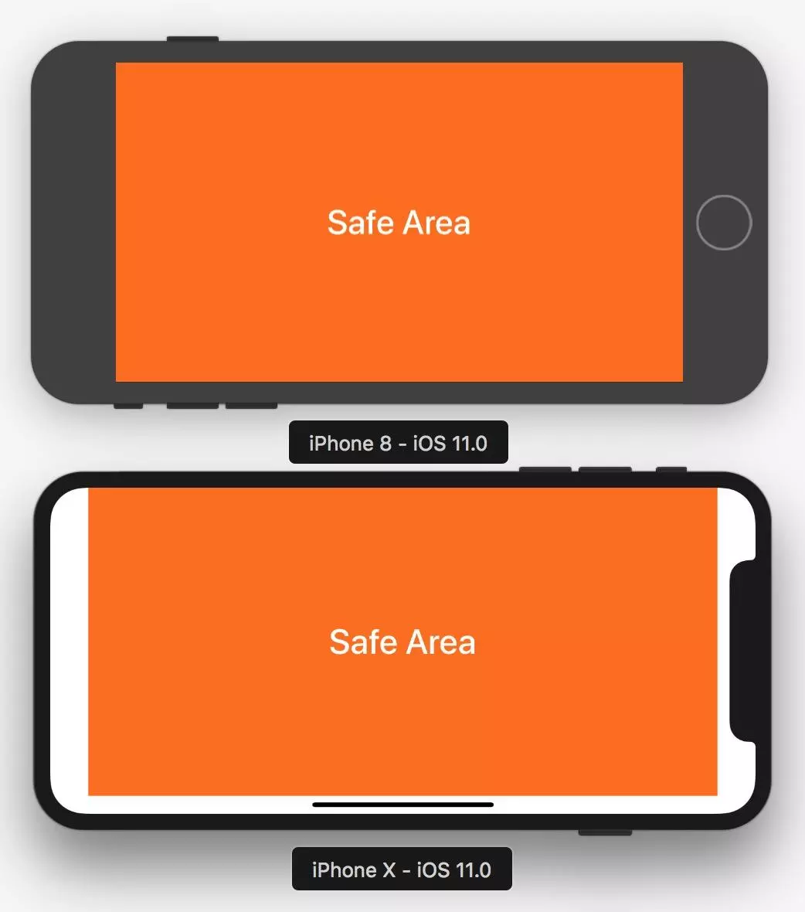

# 搞懂 Safe Area

## 概念

### 状态栏 StatusBar

手机屏幕最顶部显示时间、网络、电量的长条。带 Home 键的机型高度为 20pt，刘海屏（iPhone X 一代起）为 44pt，灵动岛机型（iPhone 14 Pro 起）更高。**不要硬编码这些数值**，用系统提供的安全区域尺寸。在 RN 中可以通过 `StatusBar` 组件设置样式，也可以隐藏。

### 导航条

状态栏下方一个高度为 44pt 的区域。在 RN 中可以自定义组件，也可以通过 react-navigation 设置。可以隐藏。

### 底部 Tab 栏

在 iOS 中指屏幕底部一个高度为 49pt 的区域（带 Home Indicator 的机型上，实际占位还要加上底部安全区）。在 RN 中可以自定义，或用 react-navigation 及其他第三方组件设置。

### Home Indicator

屏幕底部中间的一条细长指示条，竖屏时占据 34pt，横屏时占据 21pt。所有取消了 Home 键、改用 Face ID 的机型都有它——即 iPhone X 及之后的绝大多数机型；例外是仍保留 Home 键的 iPhone SE 系列。

## Safe Area

### iOS 7 之后

`UIViewController` 引入了 `topLayoutGuide` 和 `bottomLayoutGuide` 两个属性，用来描述不希望被半透明的状态栏或导航栏遮挡的最高/最低位置（status bar、navigation bar、toolbar、tab bar 等）。

`topLayoutGuide` 的含义：

- 如果导航栏（Navigation Bar）可见，`topLayoutGuide` 表示导航栏的底部。
- 如果只有状态栏可见，`topLayoutGuide` 表示状态栏的底部。
- 如果两者都不可见，表示 ViewController 的上边缘。

### iOS 11 之后

上面两个属性被弃用，引入了 Safe Area 概念，改用 `safeAreaInsets` / `safeAreaLayoutGuide`。

### 模拟 iPhone X 的 safe area

在没有刘海屏真机时，可以给旧机型手动追加安全区来模拟。注意 `additionalSafeAreaInsets` 是**在系统已有的安全区之上叠加**，不是设置绝对值——所以竖屏顶部写 24 而不是 44：旧机型已有 20pt 状态栏，20 + 24 = 44。

```swift
// 竖屏
additionalSafeAreaInsets.top = 24.0
additionalSafeAreaInsets.bottom = 34.0

// 竖屏，status bar 隐藏（此时系统安全区为 0，需要补满 44）
additionalSafeAreaInsets.top = 44.0
additionalSafeAreaInsets.bottom = 34.0

// 横屏
additionalSafeAreaInsets.left = 44.0
additionalSafeAreaInsets.bottom = 21.0
additionalSafeAreaInsets.right = 44.0
```





## H5 页面怎么适配

上面讲的都是原生侧。在 WebView 或 Safari 里，用 CSS 的 `env()` 环境变量读取安全区尺寸。

**前提**：viewport 必须声明 `viewport-fit=cover`，否则页面不会延伸到安全区之外，`env()` 全部返回 0。

```html
<meta name="viewport" content="width=device-width, initial-scale=1, viewport-fit=cover">
```

然后就能用四个环境变量：

```css
.page {
    padding-top: env(safe-area-inset-top);
    padding-bottom: env(safe-area-inset-bottom);
    padding-left: env(safe-area-inset-left);
    padding-right: env(safe-area-inset-right);
}
```

**推荐**配合 `max()` 使用，保证在没有安全区的设备上也有一个最小间距：

```css
.bottom-bar {
    /* 刘海屏取 34px，普通屏取 16px，二者取大 */
    padding-bottom: max(16px, env(safe-area-inset-bottom));
}
```

`env()` 也接受兜底值，用于不支持该函数的老浏览器：

```css
padding-bottom: env(safe-area-inset-bottom, 16px);
```

## RN 页面怎么适配

有两种方式，优先用第二种。

**推荐**：`react-native-safe-area-context`。社区标准方案，react-navigation 内部就依赖它。它同时支持 iOS 和 Android，提供 `useSafeAreaInsets()` 拿到具体数值，可以自己决定把 inset 加在 padding 还是 margin 上。

```jsx
import { useSafeAreaInsets } from "react-native-safe-area-context";

function Screen() {
    const insets = useSafeAreaInsets();
    return <View style={{ paddingBottom: Math.max(16, insets.bottom) }} />;
}
```

RN 内置的 `SafeAreaView` 更简单，但只在 iOS 上生效，且只能整体套一层 padding，无法单独控制某一边。

```jsx
import { SafeAreaView } from "react-native";

<SafeAreaView style={{ flex: 1 }}>{/* ... */}</SafeAreaView>;
```

## 参考

> **推荐** Layout — Apple Human Interface Guidelines https://developer.apple.com/design/human-interface-guidelines/layout

> env() https://developer.mozilla.org/zh-CN/docs/Web/CSS/env

> react-native-safe-area-context https://github.com/AppAndFlow/react-native-safe-area-context

> 最近很火的 Safe Area 到底是什么 https://www.jianshu.com/p/63c0b6cc66fd

> iOS 11 适配-Safe Area https://blog.csdn.net/u011656331/article/details/78365326
