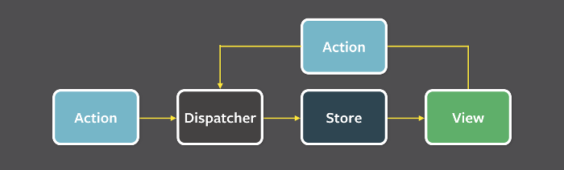

# 状态管理对比

按出现顺序梳理 Flux → Redux → Vuex → MobX 的设计思路。四者的现状变化都不小，各章开头有标注。

现在的默认选择：

- **React** —— 用 Redux 就用官方的 [Redux Toolkit](https://redux-toolkit.js.org/)；轻量场景用 [Zustand](https://zustand.docs.pmnd.rs/) 这类原子化方案。
- **Vue** —— 用 [Pinia](https://pinia.vuejs.org/)。Vuex 官网首页已明确写着「Pinia is now the new default」。

## 1. Flux

**（已过时）** Flux 是 Facebook 提出的架构思想，它的参考实现 `facebook/flux` 仓库已归档（现位于 [facebookarchive/flux](https://github.com/facebookarchive/flux)）。作为**思想**它仍然是理解后面所有方案的起点——单向数据流这一条被 Redux、Vuex 全盘继承——但不要在新项目里引入这个库。

Flux 的最大特点就是数据都是单向流动的。



- **Dispatcher**：分发中心，管理所有数据流向，将 Action 派发到 Store
- **Store**：存储状态、处理数据相关逻辑
- **Action**：动作，只是一个简单的对象，包含 `actionType` 和 payload
- **View**：页面/组件，接收到 change 事件后更新页面

### Dispatcher

```js
var Dispatcher = require("flux").Dispatcher;
var AppDispatcher = new Dispatcher();
var ListStore = require("../stores/ListStore");

// 注册回调函数
AppDispatcher.register(function(action) {
    switch (action.actionType) {
        case "ADD_NEW_ITEM":
            // Store 接收 payload，处理数据
            ListStore.addNewItemHandler(action.text);
            // 同时发布事件
            ListStore.emitChange();
            break;
        default:
        // no op
    }
});
```

### Action

```js
// 引入 Dispatcher
var AppDispatcher = require("../dispatcher/AppDispatcher");

var ButtonActions = {
    addNewItem: function(text) {
        // 分发动作 payload 给所有注册回调
        AppDispatcher.dispatch({
            actionType: "ADD_NEW_ITEM",
            text: text,
        });
    },
};
```

### Store

Store 自己就是一个 EventEmitter，数据变了就 emit 一个 `change` 事件，View 订阅它。

```js
var EventEmitter = require("events").EventEmitter;

var ListStore = Object.assign({}, EventEmitter.prototype, {
    items: [],

    getAll: function() {
        return this.items;
    },

    addNewItemHandler: function(text) {
        this.items.push(text);
    },

    emitChange: function() {
        this.emit("change");
    },

    addChangeListener: function(callback) {
        this.on("change", callback);
    },

    removeChangeListener: function(callback) {
        this.removeListener("change", callback);
    },
});
```

### View

View 只做两件事：把 Store 的数据渲染出来，把用户操作转成 Action 发出去。

```jsx
class MyButtonController extends React.Component {
    componentDidMount() {
        ListStore.addChangeListener(this.onChange);
    }

    componentWillUnmount() {
        ListStore.removeChangeListener(this.onChange);
    }

    onChange = () => {
        this.setState({ items: ListStore.getAll() });
    };

    createNewItem = () => {
        ButtonActions.addNewItem("new item");
    };

    render() {
        return <MyButton items={this.state.items} onClick={this.createNewItem} />;
    }
}
```

## 2. Redux

**（部分过时）** 三个基本原则和下面的原理都没变，但 API 层面：`createStore` 已被软废弃，官方要求新代码用 Redux Toolkit 的 `configureStore`（内置 Immer、Thunk、DevTools，省掉绝大部分样板代码）；配套的 React 绑定也从 `connect` 转向 `useSelector` / `useDispatch`。下面的手写代码仍是理解机制的最短路径。

Redux 是超越 Flux 的一次进化。

### 三个基本原则

- 整个应用只有唯一一个可信数据源，也就是只有一个 Store
- State 只能通过触发 Action 来更改
- State 的更改必须是纯函数，也就是每次更改总是返回一个新的 State，在 Redux 里这种函数称为 Reducer

### Store

Redux 没有 Dispatcher 的概念，但 Store 里集成了 `dispatch` 方法。`store.dispatch()` 是 View 发出 Action 的唯一方法。

```js
import { createStore } from "redux";
import cartReducer from "./reducers/cart";

let store = createStore(cartReducer);
```

`createStore` 原理。核心就是闭包里存一份 `state` 和一个监听者数组：`dispatch` 拿 reducer 算出新 state 再通知所有监听者，`subscribe` 登记监听者并返回退订函数。

```js
const createStore = reducer => {
    let state;
    let listeners = [];

    const getState = () => state;

    const dispatch = action => {
        state = reducer(state, action);
        listeners.forEach(listener => listener());
    };

    const subscribe = listener => {
        listeners.push(listener);
        // 返回退订函数，避免监听者泄漏
        return () => {
            listeners = listeners.filter(l => l !== listener);
        };
    };

    // 派发一个内部 action，让各 reducer 返回自己的初始 state
    dispatch({ type: "@@redux/INIT" });

    return { getState, dispatch, subscribe };
};
```

注意最后那次 `dispatch`：真实 Redux 用的是一个带唯一 `type` 的内部 action，不能像原来那样传空对象 `{}`——reducer 里 `action.type` 取到 `undefined`，而 Redux 会对没有 `type` 的 action 直接抛错。

### View

```jsx
import store from "./store.js";

class App extends React.Component {
    handleAdd = () => {
        store.dispatch(addToCart("Coffee 500gm", 1, 250));
    };

    render() {
        return <button onClick={this.handleAdd}>加入购物车</button>;
    }
}
```

### Action

和 Flux 一样，Redux 里也有 Action。Action 是在 View 层触发的动作，告诉 Store State 要改变。

**推荐**：用纯函数 Action Creator 生成 action。类型常量集中定义，参数收在一处，比在调用点手写对象字面量更不容易出错，也便于复用和测试。

```js
export const ADD_TO_CART = "ADD_TO_CART";

function addToCart(product, quantity, unitCost) {
    return {
        type: ADD_TO_CART,
        payload: { product, quantity, unitCost },
    };
}
```

Action 本身只是一个单纯的对象，直接写也能用：

```js
const action = {
    type: "ADD_TO_CART",
    payload: {
        product: "milk 500ml",
        quantity: 1,
        unitCost: 47,
    },
};
```

### Reducer

Reducer 是 pure function，不要在 reducer 里做引入副作用的事情，比如：

- 直接修改传入的 state 参数对象
- 请求 API
- 调用不纯的函数，比如 `Date.now()`、`Math.random()`

```js
const initialState = {
    cart: [
        {
            product: "bread 700g",
            quantity: 2,
            unitCost: 90,
        },
    ],
};

function cartReducer(state = initialState, action) {
    switch (action.type) {
        case ADD_TO_CART: {
            return {
                ...state,
                cart: [...state.cart, action.payload],
            };
        }

        case UPDATE_CART: {
            return {
                ...state,
                cart: state.cart.map(item =>
                    item.product === action.payload.product ? action.payload : item,
                ),
            };
        }

        case DELETE_FROM_CART: {
            return {
                ...state,
                cart: state.cart.filter(item => item.product !== action.payload.product),
            };
        }

        default:
            return state;
    }
}
```

**推荐**：实际项目里用 Redux Toolkit 的 `createSlice` 写同样的逻辑。内部套了 Immer，可以直接「修改」state，action type 和 action creator 也自动生成——上面那三十行手写 reducer 缩成十行，且不会再出现忘记展开 state 导致的漏改。手写版留作理解不可变更新的参考。

```js
import { createSlice } from "@reduxjs/toolkit";

const cartSlice = createSlice({
    name: "cart",
    initialState,
    reducers: {
        addToCart(state, action) {
            state.cart.push(action.payload); // 看着是在改，实际产出的是新对象
        },
        deleteFromCart(state, action) {
            state.cart = state.cart.filter(item => item.product !== action.payload.product);
        },
    },
});

export const { addToCart, deleteFromCart } = cartSlice.actions;
```

## 3. Vuex

**（已过时）** Vue 官方的状态管理库已换成 Pinia，Vuex 只做维护。Vuex 官网首页原话：「Pinia is now the new default」。另外下面的 `new Vuex.Store()` 是 Vuex 3（Vue 2）的写法，Vuex 4（Vue 3）改用 `createStore()`。

Pinia 去掉了 mutation，只保留 state / getters / actions 三个概念，同步异步都写在 action 里。

### Store

```js
const store = new Vuex.Store({
    state: {
        count: 0,
    },
    mutations: {
        increment(state) {
            state.count++;
        },
    },
    actions: {
        incrementAsync({ commit }) {
            setTimeout(() => {
                commit("increment");
            }, 1000);
        },
    },
});
```

### Mutation

- 更改 Vuex 的 store 中的状态的唯一方法是提交 mutation。
- mutation 有些类似 Redux 的 Reducer，但 Vuex 不要求每次都返回一个新的 State，可以直接修改 State（Vue 的响应式系统会追踪这次修改）。
- mutation 必须是同步的，否则 devtools 无法追踪状态变化的来源。

```js
store.commit({
    type: "increment",
    amount: 10,
});
```

### Action

- Action 提交的是 mutation，而不是直接变更状态。
- Action 可以包含任意异步操作。

```js
// 以对象形式分发
store.dispatch({
    type: "incrementAsync",
    amount: 10,
});
```

Vuex 把同步和异步操作通过 mutation 和 Action 分开处理，是一种方式，但不是唯一的方式。也可以不用 Action，在应用内部调用异步请求，请求完毕直接 commit mutation。Pinia 就是选择了后者，直接取消了 mutation 这一层。

## 4. MobX

**（已过时）** 下面用的是 MobX 4/5 的装饰器写法。MobX 6 起不再要求装饰器（装饰器当时还是实验语法，跨工具链配置很麻烦），改用 `makeObservable` / `makeAutoObservable`；`mobx-react` 的 `inject` + `Provider` 也是旧模式，现在用 `observer` 配合 React Context / hooks。

MobX 6 的等价写法：

```js
import { makeAutoObservable } from "mobx";

class Store {
    a = 0;

    constructor() {
        // 自动把属性变成 observable，把方法变成 action
        makeAutoObservable(this);
    }

    incA = () => {
        this.a++;
    };

    decA = () => {
        this.a--;
    };
}
```

### 对比 Redux

同一个计数器，两种写法对照。

Redux：

```jsx
import React, { Component } from "react";
import { createStore, bindActionCreators } from "redux";
import { Provider, connect } from "react-redux";

// ① action types
const COUNTER_ADD = "counter_add";
const COUNTER_DEC = "counter_dec";

const initialState = { a: 0 };

// ② reducers
function reducers(state = initialState, action) {
    switch (action.type) {
        case COUNTER_ADD:
            return { ...state, a: state.a + 1 };
        case COUNTER_DEC:
            return { ...state, a: state.a - 1 };
        default:
            return state;
    }
}

// ③ action creator
const incA = () => ({ type: COUNTER_ADD });
const decA = () => ({ type: COUNTER_DEC });
const Actions = { incA, decA };

class Demo extends Component {
    render() {
        const { store, actions } = this.props;
        return (
            <div>
                <p>a = {store.a}</p>
                <p>
                    <button className="ui-btn" onClick={actions.incA}>
                        增加 a
                    </button>
                    <button className="ui-btn" onClick={actions.decA}>
                        减少 a
                    </button>
                </p>
            </div>
        );
    }
}

// ④ 将 state、actions 映射到组件 props
const mapStateToProps = state => ({ store: state });
const mapDispatchToProps = dispatch => ({
    // ⑤ bindActionCreators 简化 dispatch
    actions: bindActionCreators(Actions, dispatch),
});

// ⑥ connect 产生容器组件
const Root = connect(mapStateToProps, mapDispatchToProps)(Demo);

const store = createStore(reducers);

export default class App extends Component {
    render() {
        return (
            <Provider store={store}>
                <Root />
            </Provider>
        );
    }
}
```

MobX：

```jsx
import React, { Component } from "react";
import { observable, action } from "mobx";
import { Provider, observer, inject } from "mobx-react";

// 定义数据结构
class Store {
    // ① 使用 observable decorator
    @observable a = 0;
}

// 定义对数据的操作
class Actions {
    constructor({ store }) {
        this.store = store;
    }
    // ② 使用 action decorator
    @action
    incA = () => {
        this.store.a++;
    };
    @action
    decA = () => {
        this.store.a--;
    };
}

// ③ 实例化单一数据源
const store = new Store();
// ④ 实例化 actions，并且和 store 进行关联
const actions = new Actions({ store });

// ⑤ inject 向业务组件注入 store、actions，和 Provider 配合使用
@inject("store", "actions")
@observer
class Demo extends Component {
    render() {
        const { store, actions } = this.props;
        return (
            <div>
                <p>a = {store.a}</p>
                <p>
                    <button className="ui-btn" onClick={actions.incA}>
                        增加 a
                    </button>
                    <button className="ui-btn" onClick={actions.decA}>
                        减少 a
                    </button>
                </p>
            </div>
        );
    }
}

class App extends Component {
    render() {
        // ⑥ 使用 Provider，在被 inject 的子组件里可以通过 props.store、props.actions 访问
        return (
            <Provider store={store} actions={actions}>
                <Demo />
            </Provider>
        );
    }
}

export default App;
```

### 取舍

- Redux 数据流流动很自然，可以充分利用时间回溯的特征，增强业务的可预测性；MobX 没有那么自然的数据流动，也没有时间回溯的能力，但是 View 更新很精确，粒度控制很细。
- Redux 通过引入中间件来处理副作用；MobX 没有中间件，副作用的处理比较自由。
- Redux 的样板代码更多——但这是特定设计约束换来的。MobX 基本没有多余代码，直接改数据就行。

并没有孰优孰劣。小项目用 MobX 比较灵活；大型项目里 MobX 这种缺少约束和统一最佳实践的方式，容易让代码难以维护。

这个结论成文较早，今天的取舍已经不同：Redux Toolkit 把样板代码削掉了一大半，Redux 和 MobX 的代码量差距不再明显；而「要不要独立状态库」本身也成了一个问题——服务端数据交给 React Query / SWR 这类请求库，剩下的少量全局 UI 状态用 Zustand 甚至 Context 就够了，很多项目已经不需要完整的状态管理方案。

## 相关

仓库内相关笔记与 demo：[React-Redux 原理](react-redux-internals.md) · [redux-implementation.html](redux-implementation.html) · [observable-array.html](observable-array.html) · [vue-two-way-binding.html](vue-two-way-binding.html)
