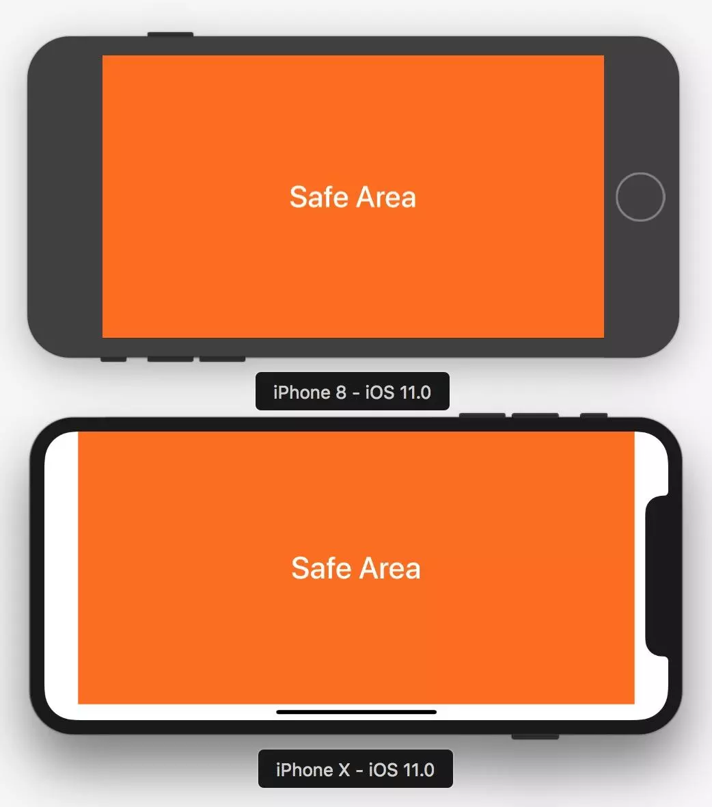

## 概念

### 状态栏 StatusBar
手机屏幕最顶部显示时间、网络、电量的长条。一般情况下高度为 20 ，iphoneX 高度为 44， 在RN中可以通过 StatusBar 组件设置。可以隐藏。

### 导航条
在状态条下一个高度为 44 的区域。在RN中可以自定义组件，也可以通过 react-navigation 设置。可以隐藏。

### 底部 Tab 栏
在 iOS 中是指屏幕底部一个高度为 49 的区域。在RN中可以自定义或 react-navigation 或其他第三方组件设置。

### Home Indicator
屏幕底部中间的一个细长条，高度为 34，这这些机型上有这个区域： iPhone X、  iPhone XS、 iPhone XR、 iPhone XS Max

## Safe Area

### iOS 7 之后
UIViewController 引入了 topLayoutGuide 和 bottomLayoutGuide 两个属性来描述不希望被透明的状态栏或者导航栏遮挡的最高位置(status bar, navigation bar, toolbar, tab bar 等)。

topLayoutGuide 属性的含义

* 如果导航栏（Navigation Bar）可见，topLayoutGuide表示导航栏的底部。
* 如果状态栏可见，topLayoutGuide表示状态栏的底部。
* 如果都不可见，表示ViewController的上边缘。

### iOS 11 之后
弃用了这两个属性， 并且引入了 Safe Area 这个概念。

### 模拟 iPhone X 的 safe area
```js
//竖屏
additionalSafeAreaInsets.top = 24.0
additionalSafeAreaInsets.bottom = 34.0

//竖屏, status bar 隐藏
additionalSafeAreaInsets.top = 44.0
additionalSafeAreaInsets.bottom = 34.0

//横屏
additionalSafeAreaInsets.left = 44.0
additionalSafeAreaInsets.bottom = 21.0
additionalSafeAreaInsets.right = 44.0
```




> 最近很火的 Safe Area 到底是什么 https://www.jianshu.com/p/63c0b6cc66fd
> iOS11适配-Safe Area https://blog.csdn.net/u011656331/article/details/78365326